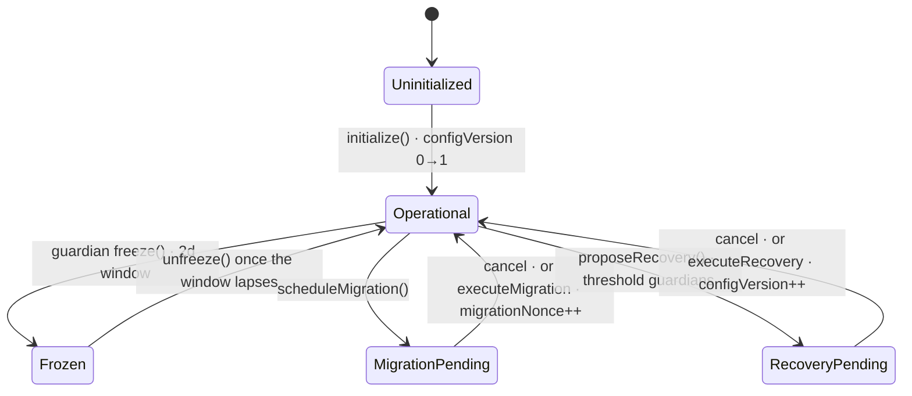

# Loom

**Immutable, self-sovereign account infrastructure for Ethereum.**

Loom is the immutable account layer beneath wallets, fintech platforms,
institutions, and developer applications. It fixes the account's security model
and leaves every product free to build its own experience on top: a fintech can
embed it behind passkeys, and a privacy wallet can offer a fully self-sovereign
experience — both inherit the same guarantees.

> **A user's account should outlive every product and infrastructure provider
> built around it.**

## Highlights

- **Immutable core** — no admin, no upgrade proxy, no developer or factory authority.
- **Passkey-native** — WebAuthn / P-256 validation with multi-passkey MFA.
- **Guardian recovery** — threshold guardians, visible delay, and freeze, with no guardian spending power.
- **Sovereign migration** — move an account forward with no custodian in the loop.
- **Walkaway guarantee** — the account stays usable and recoverable even if every Loom service disappears.
- **SDK-first** — headless packages that choose no default RPC, bundler, or paymaster.

## Why Loom

Custodial platforms simplify onboarding by reintroducing trust. Traditional
self-custody preserves ownership but pushes seed phrases, fragmented tooling, and
fragile recovery onto users. Replacing seed phrases with company accounts or
mandatory infrastructure does not remove trust — it only changes who users are
forced to trust.

Loom treats this as an architectural problem: applications should compete on
experience, not on owning user accounts, and users should be able to change
wallets, providers, authentication, and recovery models without replacing the
account they trust. The deeper rationale is in
[Design foundations](docs/project/foundations.md) and
[Product principles](docs/project/principles.md).

## Principles

- **Users own accounts** — not applications, companies, or infrastructure.
- **Security before convenience** — convenience may improve; guarantees may not weaken.
- **Keep the trusted core small** — everything else evolves independently.
- **Modular over monolithic** — capabilities compose through narrowly scoped modules.
- **Infrastructure is replaceable** — wallets, SDKs, bundlers, paymasters, RPCs, and recovery coordinators can all be swapped without changing the account.
- **Explicit authority** — nothing receives more authority than it requires, and every scope is auditable.
- **Privacy is part of security** — achieved through explicit, auditable mechanisms, not trusted intermediaries.
- **Exit must always remain possible** — no provider or organization becomes a permanent dependency.

Each principle is expanded in [Product principles](docs/project/principles.md).

## What Loom is (and is not)

Loom is account infrastructure for Ethereum: immutable smart accounts and a
deliberately small trusted foundation. Authentication, authorization, recovery,
spending policies, privacy, and future extensions are independent modules that
evolve without changing the account itself.

Loom is **not** a wallet application, a hosted service, or a required frontend,
SDK, bundler, paymaster, RPC provider, or recovery coordinator. It defines the
account — builders create the experience, and users remain in control.

Loom is built for individuals, wallet developers, fintechs, institutions,
infrastructure providers, and autonomous agents; see
[Who Loom is for](docs/project/audiences.md).

## Architecture

Loom is designed around a small immutable account core. Long-term authority
belongs to the account itself; capabilities that naturally evolve —
authentication, recovery, permissions, privacy — remain independent from it.

- **Immutable account layer** — the permanent trust anchor. Defines ownership,
  execution, and the security boundaries that stay stable for the account's
  lifetime.
- **Authorization layer** — validators, passkeys, session permissions, and
  spending policies as narrowly scoped components. New authentication methods
  do not require redesigning the account.
- **Recovery layer** — a bounded security policy, not an ownership transfer:
  explicit authority, observable state transitions, no guardian spending power.

Full detail lives in [Architecture](docs/design/architecture.md),
[Execution model](docs/design/execution.md),
[Recovery](docs/design/recovery.md), and
[Privacy adapters](docs/design/privacy-adapters.md).

### Account lifecycle

A `LoomAccount` is deliberately **not** a single linear state machine. Its
observable state is the product of several mostly-orthogonal dimensions, tied
together by a monotonic `configVersion` that invalidates any stale pending
operation. An account can be frozen while a migration and a recovery are both
pending.



`Frozen`, `MigrationPending`, and `RecoveryPending` overlay `Operational`
independently. The authoritative, code-derived model — including the freeze
carve-out for recovery and the invariants that enforce it — is in
[`docs/design/lifecycle.md`](docs/design/lifecycle.md).

## Implemented today

This repository contains the on-chain account and authorization layer plus early
local SDK packages. It does **not** contain the future mobile wallet, production
private transfer system, light client, cross-chain router, or hosted
infrastructure.

**Account** — immutable smart accounts with no developer, factory, admin, or
proxy-upgrade authority; ERC-4337 v0.9 validation with atomic single/batch
execution; ERC-1271 signatures with policy-aware restrictions;
provider-independent direct execution; a limited ERC-7579 adapter surface with
unsupported modes rejected.

**Authentication** — WebAuthn / P-256 passkeys and multi-passkey threshold (MFA)
validation.

**Authorization** — bounded and granular session permissions, granular execution
policies, spending policies, and paymaster restrictions.

**Recovery** — guardian recovery with visible delay, cancellation, and expiry;
complete validator-set replacement; single-guardian emergency freeze without
spending authority.

**Migration** — delayed sovereign migration with destination code/config
binding, cancellation, expiry, and atomic execution under hook enforcement.

**SDK** — local account SDK (`@loom/account`), wallet engine SDK (`@loom/sdk`),
and privacy SDK foundations (`@loom/privacy`). The SDK deliberately chooses no
default RPC, bundler, paymaster, relayer, signer, recovery coordinator, or
privacy provider; those adapters are supplied by the developer or user.

See the [Roadmap](docs/project/roadmap.md) for direction beyond what ships today.

## Examples

The [`examples/`](examples/README.md) directory shows the same account powering
different products under the same security model:

- **Embedded fintech** — self-sovereign accounts inside an existing app, behind
  passkey authentication:
  [`enterprise-onboarding.mjs`](examples/enterprise-onboarding.mjs)
  ([integration guide](docs/guides/enterprise-integration.md)).
- **Consumer wallet** — a privacy-first wallet with modular recovery:
  [`individual-passkey-wallet.mjs`](examples/individual-passkey-wallet.mjs).

Each script is runnable and self-verifying: it installs a global-`fetch` trap, so
a hidden default-provider call would fail the run — the walkaway guarantee,
demonstrated.

## Development

```sh
npm ci
npm run verify:quick
```

Node.js 22 and Foundry v1.7.1 are the supported baseline. `verify:quick` runs
formatting, linting, size checks, gas-snapshot checks, tests, and source-policy
checks; `npm run verify` additionally runs the CI fuzz and invariant profile.

Every change is expected to include appropriate testing, documentation, and
review. Contributions that simplify the trusted core, improve auditability,
strengthen modularity, or reduce trust assumptions are strongly encouraged. See
[Contributing](CONTRIBUTING.md).

## Security status

Loom is **pre-audit** software. Do not use it to secure production assets.

Current evidence includes unit and EntryPoint-integration tests, fuzz tests,
stateful invariants, gas snapshots, static analysis, and selected Halmos formal
properties — useful evidence, not a claim of complete correctness. Before
production use, Loom needs independent audit, live multi-bundler testing, browser
and hardware passkey fixtures, public deployment rehearsals, stronger formal
coverage, and a funded bug bounty. See the
[threat model](docs/security/threat-model.md) and
[production readiness gates](docs/security/production-readiness.md).

## Documentation

- [Documentation index](docs/README.md)
- [Product principles](docs/project/principles.md) ·
  [Design foundations](docs/project/foundations.md) ·
  [Who Loom is for](docs/project/audiences.md) ·
  [Roadmap](docs/project/roadmap.md)
- [Architecture](docs/design/architecture.md) ·
  [Account lifecycle](docs/design/lifecycle.md) ·
  [Execution model](docs/design/execution.md) ·
  [Authentication](docs/design/authentication.md) ·
  [Permissions](docs/design/permissions.md) ·
  [Recovery](docs/design/recovery.md)
- [Threat model](docs/security/threat-model.md) ·
  [Assumptions and residual risks](docs/security/assumptions-and-risks.md) ·
  [Production readiness](docs/security/production-readiness.md)
- [Contributing](CONTRIBUTING.md) · [Security policy](SECURITY.md)

## License

Licensed under the MIT License.
