# Account Lifecycle State Machine

This document is the authoritative, code-derived model of a `LoomAccount`'s
observable states and the transitions between them. It exists because the
lifecycle was previously only recoverable by reading `src/LoomAccount.sol`
end to end.

The account is **not** a single linear state machine. Its observable state is
the product of several mostly-orthogonal dimensions:

1. **Bootstrap** — one-way `Uninitialized → Initialized` (`configVersion 0 → 1`).
2. **Execution gate** — an `Operational`/`Frozen` overlay driven by `frozenUntil`.
3. **Pending migration** — a single `pendingMigration` slot.
4. **Scheduled operations** — a mapping; any number can be pending at once.
5. **Pending recovery** — held in the `RecoveryManager` module, keyed by account,
   **not** in account storage.

The cross-cutting invariant that ties them together is `configVersion`: every
authority-changing transition advances it monotonically, which invalidates any
pending recovery, migration, or scheduled operation that snapshotted an older
version.

## Primary lifecycle (happy path plus authority branches)

```mermaid
stateDiagram-v2
    [*] --> Uninitialized
    Uninitialized --> Operational: initialize()/constructor<br/>configVersion 0→1

    Operational --> Operational: execute / executeDirect<br/>(validator-authorized)
    Operational --> Operational: scheduleCall then executeScheduled<br/>(after MIN_EXTERNAL/CONFIG_DELAY)
    Operational --> Operational: installModule / uninstallModule<br/>setGuardianConfig (timelocked, configVersion++)

    Operational --> Frozen: guardian freeze()<br/>frozenUntil = now + FREEZE_DURATION (2d)
    Frozen --> Frozen: freeze() extends the window
    Frozen --> Operational: unfreeze() after expiry<br/>OR window lapses

    Operational --> MigrationPending: scheduleMigration()
    MigrationPending --> Operational: cancelMigration()<br/>cancelMigrationWithGuardians()
    MigrationPending --> Operational: executeMigration()<br/>(after readyAt; assets moved,<br/>account persists, migrationNonce++)

    Operational --> RecoveryPending: RecoveryManager.proposeRecovery()<br/>(threshold guardians, in the module)
    RecoveryPending --> Operational: cancelRecovery()<br/>cancelRecoveryWithGuardians()
    RecoveryPending --> Operational: executeRecovery()<br/>(after RECOVERY_DELAY 3d;<br/>validators replaced, configVersion++)
```

`Frozen`, `MigrationPending`, and `RecoveryPending` are drawn as branches off
`Operational` for readability, but they are **orthogonal**: an account can be
frozen while a migration and a recovery are both pending. The next section gives
the exact interaction rules.

## The freeze overlay is orthogonal, not a step

`freeze()` sets a time-boxed `frozenUntil`; it does not consume or block the
pending-migration or pending-recovery slots. While `block.timestamp <
frozenUntil`:

| Action | While frozen |
|---|---|
| `execute` / `executeDirect` (ordinary) | **Blocked** (`AccountFrozen`) |
| `execute` of exactly a recovery-cancel call | **Allowed** (`_isFrozenSafe` carve-out) |
| `executeScheduled` | **Blocked** |
| `executeMigration` | **Blocked** |
| `RecoveryManager.executeRecovery` → `recoverConfiguration` | **Allowed** (no frozen check, by design) |
| `freeze()` again | Allowed (extends window) |
| guardian migration/recovery cancellations | Allowed |

Recovery execution is deliberately **not** blocked by a freeze: the freeze exists
so a single guardian can buy the window for the full guardian threshold to
recover a compromised account. Blocking recovery during a freeze would let a
compromised primary validator freeze the account to stall its own replacement.
See `test/RecoveryManager.t.sol:testGuardianFreezeProtectsRecoveryFromScheduledConfigBump`.

## configVersion is the anti-stale-authority spine

`_advanceConfig` runs on every authority mutation: guardian config change, module
install/uninstall, recovery application, and any module-signalled change via
`notifyConfigChange`. Because pending operations snapshot the `configVersion`
at proposal time and re-check it at execution:

- a scheduled operation's `operationId` includes `configVersion`, so any config
  change orphans it;
- `executeMigration` reverts if `configVersion != migration.configVersion`;
- `executeRecovery` reverts if the account's `configVersion` moved.

This is the mechanism behind the "config version never drifts / no stale
authorization" property and is checked by
`test/LoomAccountInvariant.t.sol` (monotonicity) and the per-feature Halmos
proofs under `test/formal/`.

## What "Migrated" is and is not

`executeMigration` runs a bound batch of calls (typically moving assets and
authority to a destination account whose code hash and config hash were
committed at schedule time). It is **not** a self-destruct and **not** a terminal
state: the source account clears `pendingMigration`, bumps `migrationNonce`, and
returns to `Operational`. Sovereignty comes from the destination binding and the
`MIN_CONFIG_DELAY` window, not from destroying the source.

## Related material

- [`docs/design/recovery.md`](recovery.md) — guardian recovery details.
- [`docs/design/execution.md`](execution.md) — execution modes and scheduling.
- [`docs/design/guardians.md`](guardians.md) — the guardian Merkle model and freeze.
- [`test/LoomAccountInvariant.t.sol`](../../test/LoomAccountInvariant.t.sol) —
  the stateful invariants that enforce this model.
