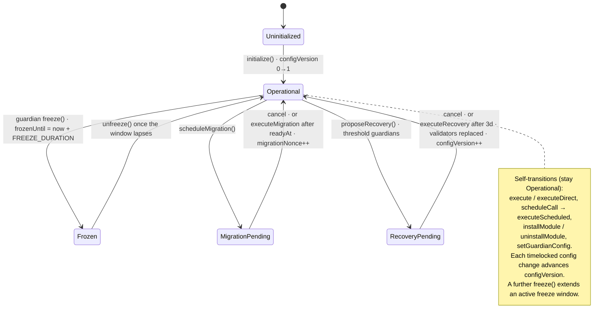

# Account Lifecycle State Machine

This document is the authoritative, code-derived model of a `LoomAccount`'s
observable states and the transitions between them. It exists because the
lifecycle was previously only recoverable by reading `src/LoomAccount.sol`
end to end.

The account is **not** a single linear state machine. Its observable state is
the product of several mostly-orthogonal dimensions:

1. **Bootstrap** — one-way `Uninitialized → Initialized` (`configVersion 0 → 1`).
2. **Execution gate** — an `Operational`/`Frozen` overlay driven by `frozenUntil`.
3. **Pending migration** — a single `pendingMigration` slot.
4. **Scheduled operations** — a mapping; any number can be pending at once.
5. **Pending recovery** — held in the `RecoveryManager` module, keyed by account,
   **not** in account storage.

The cross-cutting invariant that ties them together is `configVersion`: every
authority-changing transition advances it monotonically, which invalidates any
pending recovery, migration, or scheduled operation that snapshotted an older
version.

## Primary lifecycle (happy path plus authority branches)

```mermaid
stateDiagram-v2
    direction TB
    [*] --> Uninitialized
    Uninitialized --> Operational: initialize() · configVersion 0→1

    Operational --> Frozen: guardian freeze() · frozenUntil = now + FREEZE_DURATION
    Frozen --> Operational: unfreeze() once the window lapses

    Operational --> MigrationPending: scheduleMigration()
    MigrationPending --> Operational: cancel · or executeMigration after readyAt · migrationNonce++

    Operational --> RecoveryPending: proposeRecovery() · threshold guardians
    RecoveryPending --> Operational: cancel · or executeRecovery after 3d · validators replaced · configVersion++

    note right of Operational
        Self-transitions (stay Operational):
        execute / executeDirect, scheduleCall → executeScheduled,
        installModule / uninstallModule, setGuardianConfig.
        Each timelocked config change advances configVersion.
        A further freeze() extends an active freeze window.
    end note
```

`Frozen`, `MigrationPending`, and `RecoveryPending` are drawn as branches off
`Operational` for readability, but they are **orthogonal**: an account can be
frozen while a migration and a recovery are both pending. The next section gives
the exact interaction rules.

## The freeze overlay is orthogonal, not a step

`freeze()` sets a time-boxed `frozenUntil`; it does not consume or block the
pending-migration or pending-recovery slots. While `block.timestamp <
frozenUntil`:

| Action | While frozen |
|---|---|
| `execute` / `executeDirect` (ordinary) | **Blocked** (`AccountFrozen`) |
| `execute` of exactly a recovery-cancel call | **Allowed** (`_isFrozenSafe` carve-out), and advances `configVersion` |
| `executeScheduled` | **Blocked** |
| `executeMigration` | **Blocked** |
| `RecoveryManager.executeRecovery` → `recoverConfiguration` | **Allowed** (no frozen check, by design) |
| `freeze()` again | Allowed (extends window) |
| guardian migration/recovery cancellations | Allowed |

Recovery execution is deliberately **not** blocked by a freeze: the freeze exists
so a single guardian can buy the window for the full guardian threshold to
recover a compromised account. Blocking recovery during a freeze would let a
compromised primary validator freeze the account to stall its own replacement.
See `test/integration/RecoveryManager.t.sol:testGuardianFreezeProtectsRecoveryFromScheduledConfigBump`.

The window has to cover the whole recovery path, not just its start.
`FREEZE_DURATION` is `RECOVERY_DELAY` plus a margin to publish the recovery
execution, and `invariantFreezeOutlastsRecoveryDelay` pins that relationship so it
cannot be tuned away. See
`docs/decisions/0016-freeze-covers-recovery-path.md`.

The recovery-cancel carve-out is the one action a compromised validator can still
take while frozen, so it advances `configVersion`. That re-arms every guardian
leaf, because `freeze` allows one freeze per leaf per configuration version, and
retires every pending scheduled operation, migration, and vault withdrawal,
because each binds the configuration version it was created at. Cancelling from
inside a freeze therefore costs the canceller their pending operations and hands
the guardians another freeze. Cancelling while **not** frozen is an ordinary
uncontested action and does not advance the configuration.

A freeze on its own is a delay, not a veto. If guardians freeze but never propose
recovery, pending operations become executable again once the window lapses; a
lapsed freeze that permanently retired operations would let one guardian destroy
the owner's pending work without meeting the recovery threshold.

## Scheduled calls are windowed and instance-identified

`scheduleCall` stores `readyAt`, `expiresAt = readyAt + SCHEDULE_WINDOW`, and an
instance counter. Before the window existed a scheduled call stayed executable
forever once ready, unless an unrelated configuration change happened to
invalidate it. Because `executeScheduled` is permissionless, that let anyone —
including a compromised validator who scheduled the call in the first place —
park a ready operation and publish it at the moment it was least defensible.

`operationId` is `keccak256(target, value, data, configVersion)`, so it names a
call shape at a configuration version and the same call scheduled again reuses the
slot. The counter distinguishes the current occupant from every previous one.
Consumption — cancellation or execution — clears `readyAt` and advances the
counter rather than deleting the entry, so `readyAt == 0` still means "not
scheduled" while the counter continues across instances.

Two identical calls still cannot be pending at the same time; the second
`scheduleCall` reverts with `OperationAlreadyScheduled`. That is a usability
limit, not an ambiguity: allowing concurrent duplicates would require
`executeScheduled` to name which instance it means, and it currently identifies
the operation by its call shape alone.

`cancelScheduledWithGuardians` gives the guardian threshold the same cancellation
power it already has over migrations, vault withdrawals, recovery, and keystore
sync. Guardians gain no execution or spending authority; cancellation is the whole
power. The cancellation digest binds the instance counter, so a revealed approval
cannot be replayed against a re-scheduled operation.

## configVersion is the anti-stale-authority spine

`_advanceConfig` runs on every authority mutation: guardian config change, module
install/uninstall, recovery application, and any module-signalled change via
`notifyConfigChange`. Because pending operations snapshot the `configVersion`
at proposal time and re-check it at execution:

- a scheduled operation's `operationId` includes `configVersion`, so any config
  change orphans it;
- `executeMigration` reverts if `configVersion != migration.configVersion`;
- `executeRecovery` reverts if the account's `configVersion` moved.

This is the mechanism behind the "config version never drifts / no stale
authorization" property and is checked by
`test/invariant/LoomAccountInvariant.t.sol` (monotonicity) and the per-feature Halmos
proofs under `test/formal/`.

## What "Migrated" is and is not

`executeMigration` runs a bound batch of calls (typically moving assets and
authority to a destination account whose code hash and config hash were
committed at schedule time). It is **not** a self-destruct and **not** a terminal
state: the source account clears `pendingMigration`, bumps `migrationNonce`, and
returns to `Operational`. Sovereignty comes from the destination binding and the
`MIN_CONFIG_DELAY` window, not from destroying the source.

## Related material

- [`docs/design/recovery.md`](recovery.md) — guardian recovery details.
- [`docs/design/execution.md`](execution.md) — execution modes and scheduling.
- [`docs/design/guardians.md`](guardians.md) — the guardian Merkle model and freeze.
- [`test/invariant/LoomAccountInvariant.t.sol`](../../test/invariant/LoomAccountInvariant.t.sol) —
  the stateful invariants that enforce this model.
