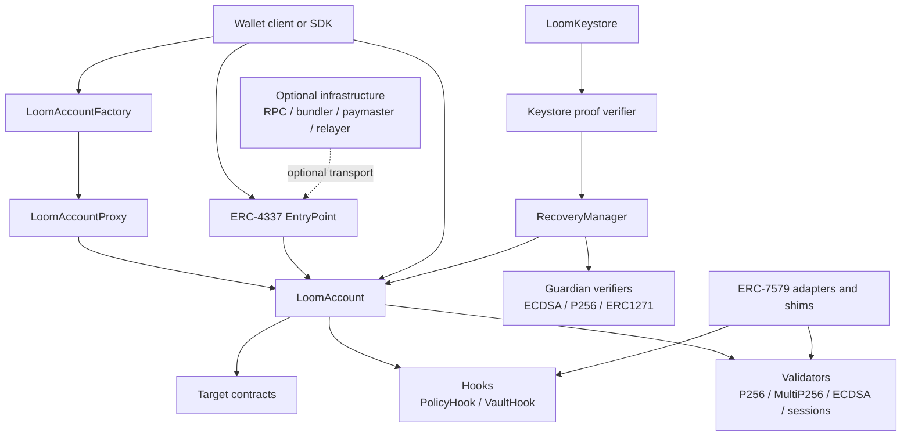
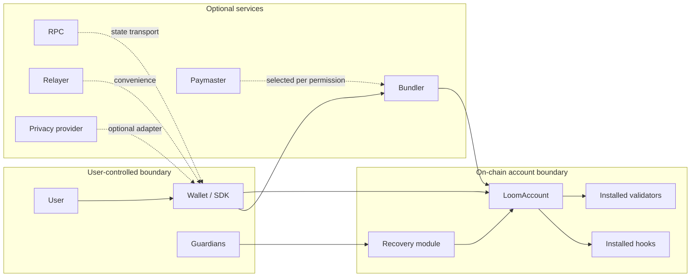
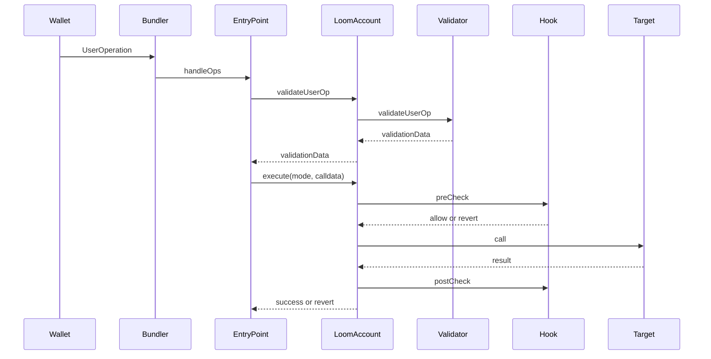
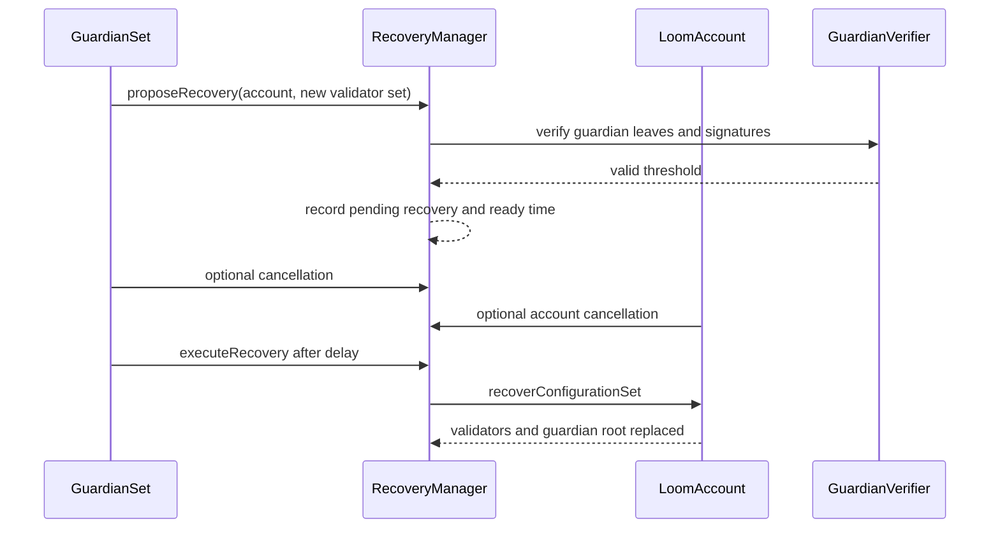
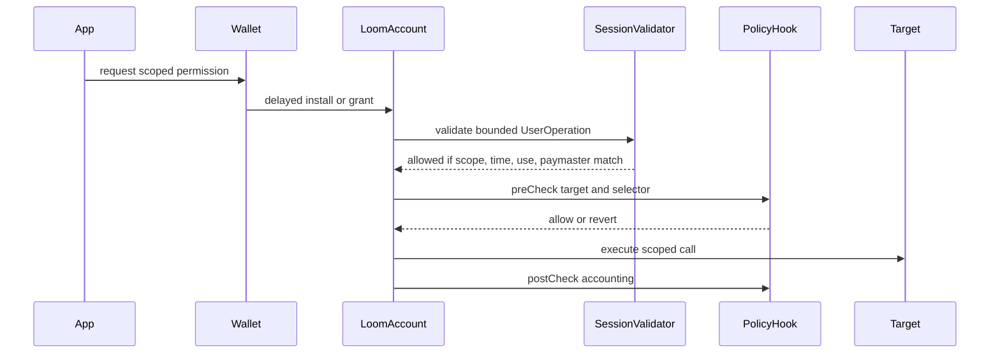
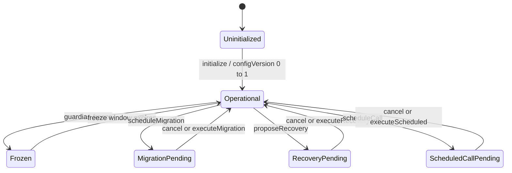
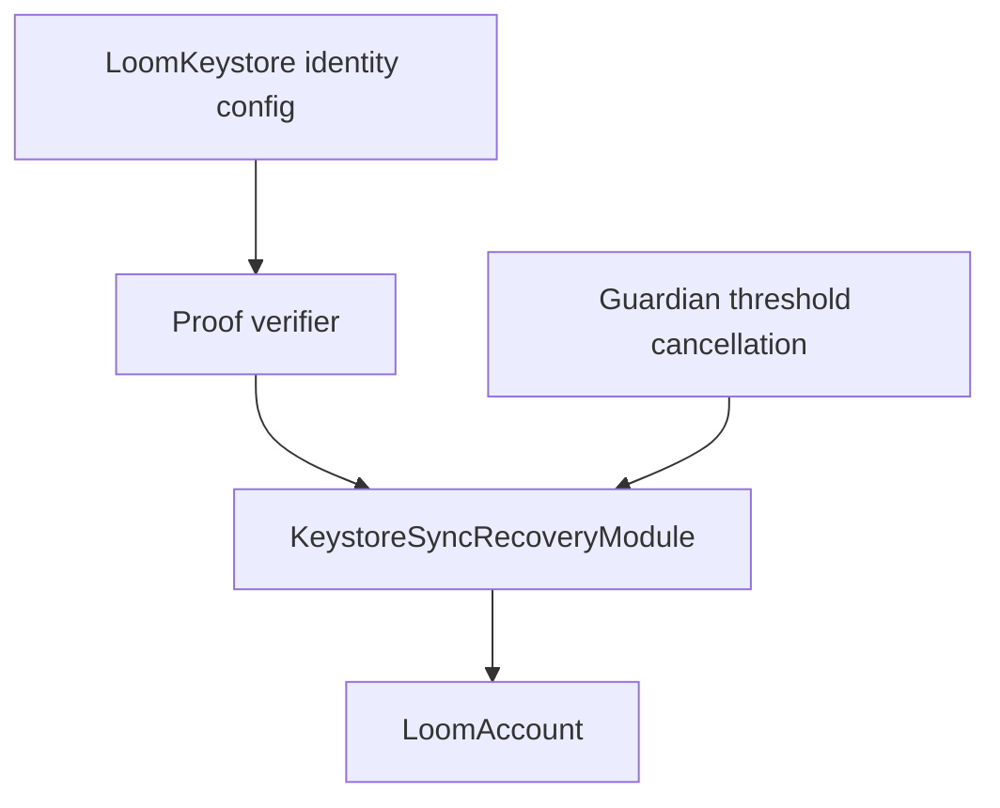

# System Diagrams

These diagrams are code-oriented reading aids. They summarize how the current
contracts fit together and where authority boundaries sit. They are not a
substitute for `src/`, `test/`, or the threat model.

## Component Diagram

Authority summary:

- `Factory` deploys configured accounts but has no post-deployment authority.
- `Proxy` dispatches to one immutable implementation and has no upgrade admin.
- `Validators` authenticate operations only within their installed profile.
- `Hooks` restrict execution and fail closed.
- `RecoveryManager` can replace validator configuration through the narrow
  recovery entry point; it cannot execute arbitrary account calls.
- Optional infrastructure transports operations but is not a trust root.

## Trust Boundary Diagram

The optional-service boundary is deliberately outside account authority. A
service can improve liveness or UX, but it must not become a permanent veto,
hidden signer, mandatory recovery provider, or global identity registry.

## ERC-4337 Execution Sequence

Execution policy is enforced at account execution time. Unsupported execution
modes fail closed.

## Recovery Sequence

Guardians do not gain normal spending authority. Recovery is delayed, visible,
cancelable, expiring, and replaces the full validator set.

## Session And Policy Enforcement

Session authority is explicit and revocable. Policy hooks remain a separate
execution guardrail.

## Lifecycle State Diagram

The account lifecycle is not a single linear state machine. This diagram is a
readable projection of the implemented overlays; the authoritative model is
`docs/design/lifecycle.md`.

`Frozen`, `MigrationPending`, `RecoveryPending`, and scheduled calls can overlap
in the implementation. `configVersion` invalidates stale authority across those
overlays.

## Keystore Sync Boundary

The keystore sync module is recovery-scoped. A production network must provide
an independently reviewed verifier and profile evidence before this becomes a
production cross-chain authority claim.
