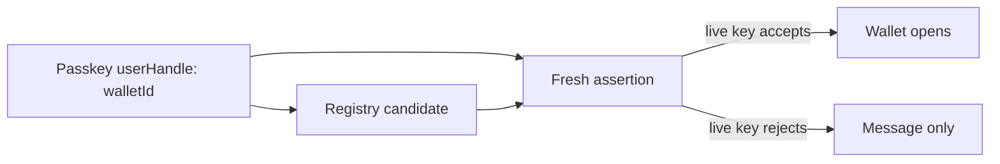
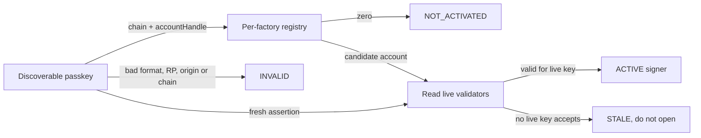

# Proposal: Model Passkey Account Status, Not Another Wallet Identifier

## Executive Recommendation

Keep the current random account-level value in WebAuthn `user.id`, but rename
it from `walletId` to `accountHandle`. It is an opaque RP account handle, not a
wallet address, validator key, credential ID, or authority token.

Expose one discovery result with four states:

| State | Registry result | Live assertion result | Product behavior |
| --- | --- | --- | --- |
| `NOT_ACTIVATED` | zero account | ceremony valid; no live-key check is possible | Passkey exists but no Loom account was activated |
| `ACTIVE` | one account | verifies against a live validator | Open signer wallet |
| `STALE` | one account | no live validator verifies | Do not open; explain that recovery/replacement revoked it |
| `INVALID` | malformed/wrong chain/RP/origin or inconsistent RPCs | rejected | Fail closed |

The registry remains a locator only. Only the fresh assertion against the live
validator decides whether the passkey currently controls the account.

## Why This Is The WebAuthn-Native Model

WebAuthn defines `userHandle` as an identifier for an RP user account, requires
discoverable credentials to return it when `allowCredentials` is empty, and
says it ought to be the same for all credentials of one account. By contrast,
credential ID is authenticator-chosen and unique per credential (`E09`). Loom's
recovery replaces the credential while preserving the account, so the stable
account handle matches the standard's lifecycle exactly.

## Current And Desired Architecture

Current naming obscures the otherwise correct locator/authority separation:

Source: [before diagram](../diagrams/passkey-account-discovery-before.mmd).

Source: [diagram](../diagrams/account-handle-status-after.mmd).

## Alternatives

### Credential-ID hash

`credentialLocator = keccak256(domain || chainId || factory || rpIdHash || rawId)`
would answer which exact passkey record was selected. It is attractive for the
word “unused”: no mapping means unbound. It is nevertheless worse for Loom's
recovery lifecycle. Every replacement passkey has a new authenticator-chosen
credential ID, so recovery must add a binding, old bindings become stale, and
the registry needs rotation/revocation or deliberately retained history. It
also does not cure first-activation ordering: an observer can copy the locator
and win a first-write denial-of-service race. It may be useful as local audit
metadata, but not as the canonical account locator.

Source: [credential-ID alternative diagram](../diagrams/credential-id-locator-after.mmd).

### Public-key commitment

An assertion returns credential ID, authenticator data, signature, and (for a
discoverable flow) user handle; it does not return the credential public key.
A clean device therefore cannot derive `keyCommitment => account` without an
external candidate source. Recovery also deliberately changes that key.

### `largeBlob`

A credential-associated blob could cache `{chainId, factory, account}`. The
standard does not allow writing it during registration; a later authentication
ceremony is required, and extension support is not universal (`E10`). Absence
could mean unsupported, failed write, lost blob, or unused credential. It may
accelerate discovery but cannot be canonical or authoritative.

Source: [largeBlob alternative diagram](../diagrams/large-blob-locator-after.mmd).

### PRF or backend index

PRF can protect encrypted local data, but it does not supply the address at
which that data can be found and changes with the replacement credential. A
backend `credentialId => account` index is operationally easy but makes a Loom
service part of clean-device discovery, contradicting walkaway operation.

Source: [backend alternative diagram](../diagrams/backend-index-after.mmd).

## Desired Invariants

- `accountHandle` is random, non-zero, RP-scoped, versioned, and carries no PII.
- Every factory-created account has exactly one immutable handle.
- Recovery credentials reuse that account handle.
- Registry presence never unlocks signer mode.
- A stale saved wallet or stale passkey never opens the wallet UI, including as
  a read-only wallet; it is shown only as a revoked/stale credential result.
- `NOT_ACTIVATED` is returned only after a valid fresh WebAuthn ceremony and two
  trusted RPC reads agree that the handle has no account.
- Initial activation remains atomic. A deployment may choose sponsored private
  activation or counterfactual self-funded activation; no activation signer is
  introduced.

## Tradeoffs

| Dimension | Assessment |
| --- | --- |
| Security | Preserves the strongest existing property: locator and authority are separate. Naming/status reduce misuse risk. Initial first-write griefing remains a separate activation concern. |
| Performance | One registry read plus validators of one account; attacker cannot enlarge the candidate set. |
| Memory/state | No new on-chain state. A rename changes ABI/schema but not storage shape. |
| Reliability | Uses the standard discoverable credential output. Dual-RPC disagreement fails closed. |
| Operability | Requires an explicit client state machine and telemetry for unbound/stale/invalid. |
| Migration | Old wallets are out of scope, so a clean immutable deployment can use the corrected names without compatibility aliases. |

## Validation Plan

- Create a passkey but do not activate: result must be `NOT_ACTIVATED`.
- Activate and rediscover on a clean device: result must be `ACTIVE`.
- Recover to a new passkey with the same handle: new passkey is `ACTIVE`; old
  passkey is `STALE` and never opens Saved Wallets or Send.
- Reject wrong chain, RP ID, origin, challenge, UV/UP flags, and RPC disagreement
  as `INVALID`.
- Confirm a copied handle or forged registry response cannot reach signer mode.
- Rehearse sponsored private activation, counterfactual self-funded activation,
  and receipt finality separately.

## Implementation Resolution

The selected generation uses `accountHandle` consistently across contracts,
ABI, SDK, frontend, tests, ADRs, and deployment schema. The 62-byte v3 envelope
binds both chain and factory. No `walletId` compatibility alias remains.

Discovery exposes the SDK states `invalid`, `not-activated`, `active`, and
`stale`; infrastructure failures such as RPC disagreement or unreadable live
validators are errors and never downgraded to `stale`. Product copy may explain
that a stale passkey was replaced, but it must not reveal signer or account
capabilities before the live assertion succeeds.
