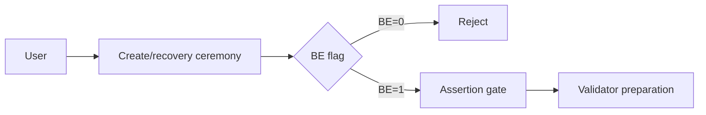
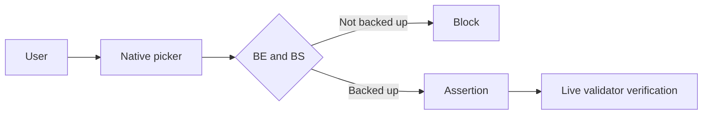
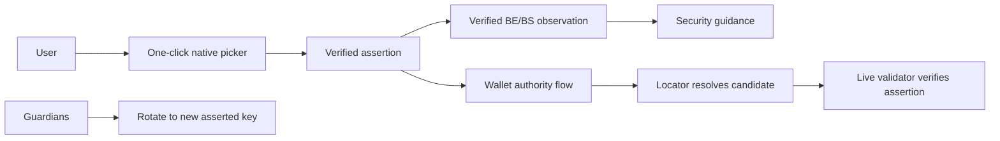

# Security Hardening Proposal: Model Passkey Availability Without Blocking Onboarding

## Decision

Keep one-click native WebAuthn onboarding and move availability guidance to Security. Accept authenticator-bound credentials, require a verified assertion before recovery publication, and require the resolved account's live validator key before discovery succeeds.

## Executive Recommendation

Option 1, **mandatory portable credential**, blocks credentials whose registration reports `BE=0`. Option 2, **risk-adaptive post-onboarding guidance**, records verified BE/BS observations, explains several protection choices, and preserves guardian recovery. Option 2 is recommended because it matches Loom's recovery model and does not misclassify roaming hardware keys.

## Evidence

| Evidence | Finding or document | What it establishes |
| --- | --- | --- |
| `E001` | WebAuthn Level 3 backup flags | BE and BS describe backup eligibility/state, not account authority. |
| `E002` | Browser ceremony source | The browser/OS owns the native authenticator chooser and returns signed authenticator data. |
| `E003` | v3 account discovery | The credential locator selects an account candidate; the live validator key verifies authority. |
| `E004` | Guardian recovery preparation | Guardians can rotate the account to a newly asserted passkey after the contract lifecycle. |
| `E005` | Local account and Security UI | Availability metadata is presentation state and can be refreshed without changing authority. |

The observed facts are the existing WebAuthn and recovery boundaries. We infer from them that a hard `BE=0` rejection conflates availability with authority and removes a valid recovery choice.

## Current Design And Failure Mode

The prior recovery preparation rejected `BE=0` before validator preparation. That avoids recommending a non-synced credential, but it also rejects a valid Windows/platform credential or roaming hardware key even when guardians remain available. The UI had no persistent verified observation, so it could not distinguish unknown, sync-pending, and backed-up states after onboarding.

## Desired Invariants

- A locator identifies only an account candidate; only a verified assertion under the account's live validator key authorizes access.
- `BE/BS` never grants or revokes wallet authority.
- `BS=1, BE=0` fails closed as invalid authenticator data.
- Recovery does not publish a newly registered key until a second assertion verifies credential use, RP ID, origin, UP, UV, locator, and signature.
- Onboarding remains one native passkey action; warnings appear in Security afterward.
- Dismissing recommendations hides presentation only, never status, authority checks, or guardian state.

## Constraints And Non-Goals

Loom cannot export WebAuthn private keys, enable provider sync, force Windows Hello versus Google versus YubiKey, or prove another device has received a credential. Provider-specific rehearsal is an operational validation task, not a protocol invariant.

## Before Architecture

Source: [before diagram](../diagrams/passkey-availability-before.mmd).

## Options

### Option 1: Mandatory portable credential

This option keeps the hard BE gate. Its strongest case is policy simplicity: every accepted recovery credential claims backup eligibility. It does not, however, prove that backup completed (`BS=1`) or that another device can use it. It also treats a physically portable security key as unacceptable, and it makes guardian recovery artificially dependent on a cloud-sync signal.

Source: [Option 1 diagram](../diagrams/passkey-availability-mandatory-after.mmd).

| Change | Before | After | Security consequence | Cost |
| --- | --- | --- | --- | --- |
| Backup policy | BE-only block | BE+BS block | Narrows accepted credentials but still cannot prove second-device readiness | Higher onboarding/recovery abandonment |
| Provider control | Implied | Still unavailable | No new authority | Users may be told to do something Loom cannot perform |

Rollback is a focused removal of the blocking predicate. Rollout would require real-device compatibility evidence before enforcement.

### Option 2: Risk-adaptive post-onboarding guidance

This option preserves the assertion and live-key gates while moving availability advice to Security. Registration and verified assertions record the last observed flags. The Security page always shows status, offers a fresh assertion check, lists cloud sync, platform credentials, roaming keys, and guardians, and allows only the recommendation detail to be dismissed.

Source: [Option 2 diagram](../diagrams/passkey-availability-risk-adaptive-after.mmd).

| Change | Before | After | Security consequence | Cost |
| --- | --- | --- | --- | --- |
| Recovery acceptance | BE=0 rejected | Any valid asserted credential accepted | Guardian recovery remains independent of provider sync | User must understand availability posture |
| Metadata | Registration flags ephemeral | Verified observation persisted/refreshed | UI claims have a ceremony-backed basis | Small local record growth |
| Discovery | Locator plus live-key check | Unchanged | Locator never becomes authority | None on the critical chain path |
| Guidance | No stateful Security view | Red/yellow/green/unknown state and choices | Reduces accidental reliance on an untested backup | UI and copy maintenance |

Rollback can remove the Security card and optional metadata while retaining the assertion and live-validator checks. Existing records remain readable because the new observation is optional.

## Comparison

| Dimension | Option 1 | Option 2 |
| --- | --- | --- |
| Security | Reduces accepted set but conflates backup policy with authority | Preserves authority gates and adds accurate availability guidance |
| Performance | One flag branch | One local write after verified ceremonies; no new chain hop |
| Memory | Neutral | Bounded metadata and dismissal identifiers |
| Reliability | Can block valid roaming/authenticator-bound recovery | Allows recovery while explicitly exposing availability risk |
| Operability | Requires provider compatibility support | Requires second-device rehearsals and copy calibration |
| Migration | Enforcement can strand flows | Optional fields permit incremental rollout and rollback |

## Recommendation

Option 2 is recommended while guardians are a first-class Loom recovery mechanism. Option 1 becomes preferable only if product policy later requires a verified, provider-certified multi-device credential and Loom can measure that readiness more strongly than BE/BS.

## Evidence Coverage And Residual Risk

| Evidence | Effect | Residual risk |
| --- | --- | --- |
| `E001` — WebAuthn flags | Addressed by separating availability from authority | Providers can report backup state differently across ecosystems |
| `E003` — live-key discovery | Preserved | RP ID/domain migration can make a synced credential unavailable |
| `E004` — guardian recovery | Preserved | Insufficient or unavailable guardians can still prevent recovery |
| `E005` — local presentation | Improved | Clearing browser storage clears dismissals and cached observations |

## Migration And Rollout

Ship optional observation fields first, then the Security card, then provider-specific help only after device rehearsals. Do not gate onboarding. Roll back presentation independently; never roll back post-registration assertion or live-validator verification.

## Validation Plan

Run domain/component tests, TypeScript, and the production build. Then rehearse: synced credential on a clean second device; YubiKey on two hosts; `BE=1,BS=0` followed by a refreshed assertion; stale credential after recovery; and guardian recovery from an authenticator-bound credential.

## Implementation Work Packages

- Persist and validate verified backup observations.
- Remove the BE=0 recovery block while retaining impossible-state rejection and the assertion gate.
- Add Security classification, refresh, provider-neutral choices, guardian action, and account-scoped dismissal.
- Carry the v3 account handle and observation through cross-device discovery and recovery save paths.
- Add focused tests and production-build verification.

## Open Questions

- Which provider/device pairs will Loom officially rehearse for release evidence?
- Should recommendation dismissal expire after a key rotation or a fixed interval?
