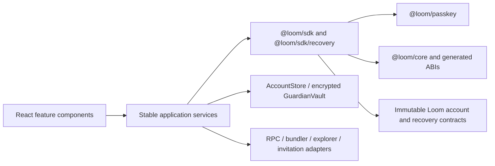
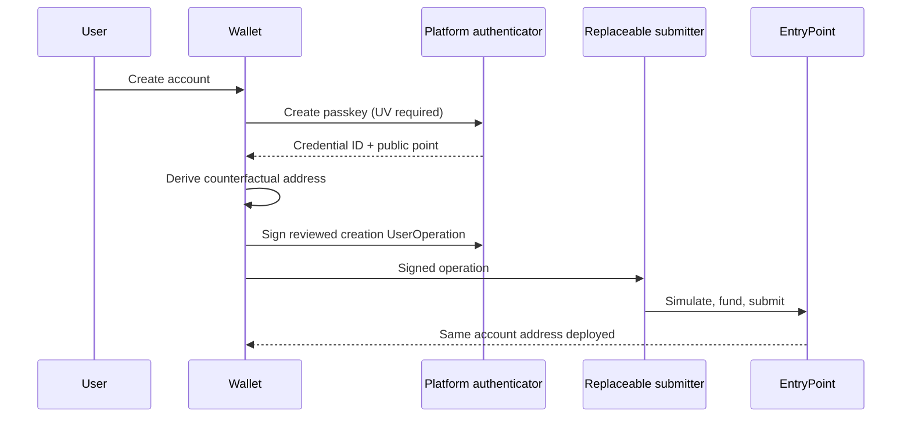
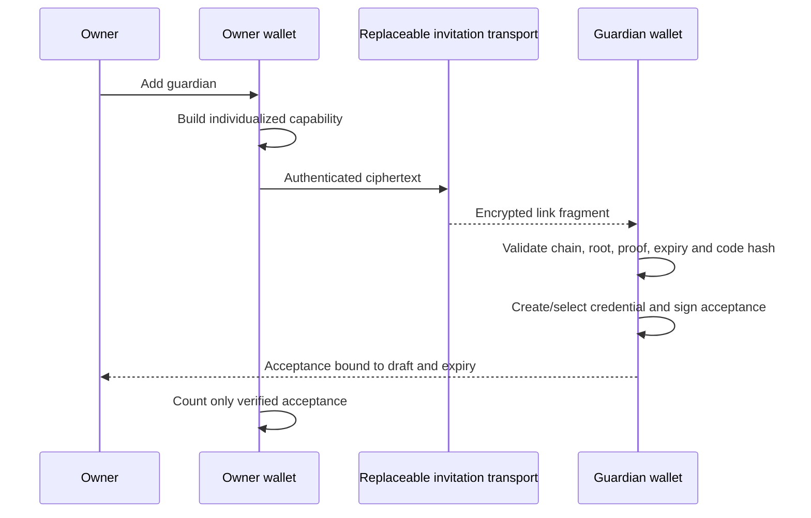
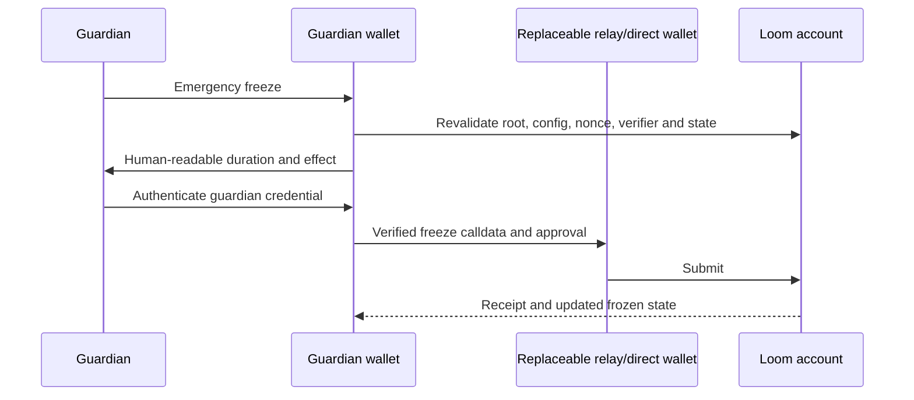

# Loom passkey wallet

A production-shaped, security-first reference wallet for Loom. It demonstrates a passkey owner, live balances and transfers, private guardian capabilities, guardian set management under the account's own timelock, guardian-initiated emergency freeze, and the complete delayed recovery lifecycle — without requiring a Loom-hosted service.

This is pre-audit reference software, not a recommendation to hold production funds. Balances, token and collectible holdings, transfers, account history, guardian setup, freeze, recovery proposal and execution use live Sepolia infrastructure by default. RPC, bundler and explorer endpoints remain overridable in Developer settings. Recovery validator provisioning follows [ADR-0013](../../docs/decisions/0013-recovery-validator-provisioning.md); runtime and receipt trust boundaries follow [ADR-0017](../../docs/decisions/0017-passkey-wallet-runtime-and-submission-boundaries.md).

## What this example proves

- Applications import guardian trees, proofs, digests, approval ordering, calldata, and scheduled-operation IDs from `@loom/sdk/recovery`; they do not reimplement them.
- A Loom account publishes only a guardian root and threshold while relationships are dormant.
- Dedicated P-256 guardian passkeys avoid exposing a guardian's primary Ethereum address.
- RPC, bundler, explorer index, invitation delivery, and storage are replaceable adapters.
- Signing, paying, submitting, and permissionless execution are distinct roles.
- Recovery preserves the account address, replaces old validator authority, and rotates the guardian root.

## Architecture



| Layer | Responsibility |
| --- | --- |
| `@loom/core` | canonical account types, derivation, generated contract ABIs |
| `@loom/passkey` | WebAuthn challenge/signature encoding and P-256 signer boundary |
| `@loom/sdk` | accounts, UserOperations, sessions, deployment normalization |
| `@loom/sdk/recovery` | guardian sets, individualized invites, digests, approvals, reviews, recovery client |
| Example | product state, screens, local stores, replaceable I/O adapters |

The evidence-backed boundary audit is in [docs/BOUNDARY_AUDIT.md](docs/BOUNDARY_AUDIT.md). Validator provisioning and guardian privacy decisions are recorded in [ADR-0013](../../docs/decisions/0013-recovery-validator-provisioning.md) and [ADR-0014](../../docs/decisions/0014-guardian-capabilities-and-execution-privacy.md).

## Five-minute local setup

```powershell
npm ci
npm --prefix examples/passkey-wallet-web run dev
```

Open the URL printed by Vite. The consumer wallet works as a UI reference without a sponsor. To enable the development submitter, copy `.env.example` to `.env`, set a Sepolia RPC URL and a throwaway funded testnet key, and restart. WebAuthn requires HTTPS or localhost and a compatible platform authenticator.

Useful checks:

```powershell
npm --prefix examples/passkey-wallet-web test
npm --prefix examples/passkey-wallet-web run typecheck
npm --prefix examples/passkey-wallet-web run build
npm --prefix packages/sdk test
npm run e2e:social-recovery
```

## Deployment configuration and passkey onboarding

Developer Settings owns deployment/RPC/bundler configuration; consumer screens do not expose it. A deployment must bind chain ID, EntryPoint, factory, account implementation, validators, policy hook, recovery module, verifier addresses, and relevant runtime code hashes. Never derive an account from an incomplete or mismatched deployment.

A versioned public account handle stores only the credential ID, P-256 public point, RP ID/origin, chain and derivation inputs. It never stores private passkey material. Derived and recovered handles are distinct because recovery preserves an existing address rather than deriving a new one.



## Sending and sessions

Home exposes Receive, Send, and Refresh, and activates an account that does not exist on chain yet. Send moves ETH, ERC-20 tokens, and ERC-721/1155 collectibles; each transfer is encoded from the chosen asset and signed by the passkey, and the recipient and amount are validated before signing. Nothing is described as simulated or confirmed on the strength of encoding alone.

Apps lists connected applications and bounded permissions: allowed targets/selectors, assets and spending limits, expiry, usage count, and immediate revocation. Application sessions never receive owner authority.

## Guardian privacy and invitations

The owner commits only `guardianRoot` and `threshold`. Each guardian gets a separate, versioned capability containing their commitment, verifier/code-hash binding, proof, set/config version, expiry, random capability ID, account/chain, and untrusted human labels. It never contains the full guardian set.

Recommended order:

1. Dedicated P-256 passkey guardian (recommended; no primary wallet address).
2. ECDSA address guardian (advanced and linkable when used).
3. ERC-1271 smart-account guardian (advanced; semantics depend on that contract).
4. Explicit compatible institutional/hardware verifier.



Generating an invitation is not delivery, and delivery is not acceptance: the guardian workspace counts a capability only once it has been accepted on the guardian's own device. A root should be committed only once threshold-many intended guardians have proven possession.

```mermaid
sequenceDiagram
  participant O as Owner
  participant W as Wallet
  participant A as Loom account
  O->>W: Review accepted threshold and proposed root
  W->>A: Schedule guardian configuration
  A-->>W: Operation ID + ready time
  Note over O,A: Enforced three-day delay; cancellation remains visible
  O->>A: Execute scheduled operation
  A-->>W: New root, threshold and config version
```

## Accounts I protect and local storage

The guardian workspace is populated only from invitations explicitly accepted on this device. `GuardianVault` is a replaceable interface; the browser implementation stores records in IndexedDB and encrypts them with AES-GCM using a non-extractable Web Crypto key also held by IndexedDB.

This protects against casual database disclosure, not a compromised origin. XSS can invoke the resident key, browser backups may include storage, and clearing site data destroys the local registry. A native wallet should replace this adapter with Secure Enclave, Android Keystore, or its platform equivalent.

Before freeze or recovery approval, a real adapter must re-read the account, root, config version, nonce, verifier runtime code hash, pending recovery, and frozen state. Device time is never authoritative for on-chain readiness.



## Recovery room

The example implements recovery as four explicit stages: verify the protected account from live state; create and persist a replacement passkey plus deterministic validator draft; collect and verify guardian responses before proposing; then resume through the contract-enforced delay and execute. The final on-chain state is re-read before new passkey metadata is linked to the existing Saved Wallet identity.

Recovery requests bind the same account, chain, current root/config version, replacement credential/validator, expiry, and replay-resistant nonce. An implementation may derive a 64-bit grouped comparison code from that exact proposal digest and compare it over a separate trusted channel — derived from the live digest, never from a fixed value.

`createGuardianRecoveryClient` also fails closed unless the replacement is present in `trustedRecoveryValidators`, its deployed runtime bytecode matches the manifest code hash, its P256 initializer has the exact supported shape, and its policy hook is explicitly allowed. Treat this profile as signed deployment metadata, not user-supplied recovery input.

Portable recovery requests and guardian responses can be copied as versioned JSON or delivered as encrypted fragment links. Fragment key material is not sent to the web server. This transport provides confidentiality and integrity for the artifact, not guardian authority; the receiver still revalidates live root, config version, verifier bytecode, proof, digest, expiry and signature.

```mermaid
sequenceDiagram
  participant U as Recovering user
  participant W as Wallet
  participant M as Encrypted mailbox
  participant G1 as Guardian 1
  participant G2 as Guardian 2
  U->>W: Verify account and create replacement passkey
  W->>M: Guardian-specific encrypted requests
  M-->>G1: Opaque capability
  M-->>G2: Opaque capability
  G1->>G1: Review state and compare short code
  G2->>G2: Review state and compare short code
  G1-->>M: Encrypted approval
  G2-->>M: Encrypted approval
  M-->>W: Ciphertexts
  W->>W: Verify each proof/signature; sort and count locally
```

```mermaid
sequenceDiagram
  participant W as Recovering wallet
  participant S as Replaceable submitter
  participant R as RecoveryManager
  W->>S: Threshold-approved proposal
  S->>R: Propose recovery
  R-->>W: Recovery ID, ready time, expiry
  Note over W,R: Enforced delay; owner and guardians can cancel
  W->>R: Permissionless execute when ready
  R-->>W: Same account, new validator authority, rotated guardian root
```

```mermaid
sequenceDiagram
  participant C as Owner or threshold guardians
  participant W as Wallet
  participant R as RecoveryManager
  C->>W: Review pending recovery and cancellation authority
  W->>R: Cancel with owner operation or guardian approvals
  R-->>W: Cancelled; approvals and request become stale
```

## On chain versus off chain

| On chain | Off chain by default |
| --- | --- |
| Guardian root and threshold | Guardian names and relationships |
| Recovery module/config version | Full set membership and individual proofs |
| Freeze and pending recovery state | Invitations, acceptances, coordination messages |
| Proposal digest/validator transition when used | Local guardian dashboard metadata |
| Guardian material disclosed by an executed approval | Recovery-room plaintext and decryption keys |

Dormant relationships remain hidden. Acting with ECDSA/ERC-1271 can reveal a linkable address. Acting with a dedicated P-256 guardian reveals the recovery-specific public credential and proof. Current approvals are not anonymous at execution time; ZK threshold proofs, FROST, BLS, and anonymous credentials require separate design and audit (ADR-0014).

## Relayer and validator provisioning trust

Relays transport already-authorized operations. They can censor, delay, observe metadata, or waste availability, but must not gain account authority. Users can replace them with direct transactions or another bundler/submitter. Permissionless scheduled/recovery execution is labelled as such; it is not sponsor authority.

`sponsor-server.mjs` is development-only, spends a configured testnet key, accepts one configured origin, simulates before paying, and must still sit behind operator authentication and rate limiting before any public exposure. It does not provide validator deployment. ADR-0013 prefers an audited permissionless deterministic validator factory; no production contract was changed until that design receives dedicated threat analysis and verification.

## Production checklist

- Serve the static build over HTTPS with `default-src 'self'`, no inline executable script, no remote scripts, `object-src 'none'`, `base-uri 'none'`, and restrictive connect/frame policies.
- Pin and verify chain ID, RP ID/origin, deployment addresses, runtime code hashes, and supported verifier family.
- Require WebAuthn user verification; handle rejection and credential loss explicitly.
- Use independent RPC checks for high-value state and revalidate balances/nonces after reorgs.
- Authenticate and rate-limit funded infrastructure; cap bodies and never log secrets, invites, signatures, or private relationship metadata.
- Verify token metadata and destination addresses; show checksum/similarity warnings and exact approvals.
- Back up public account handles and guardian capabilities through user-controlled encrypted export.
- Run the full repository verification, contract E2E, dependency audit, CSP/browser, accessibility, and operational-failure rehearsals.

## Security limitations and browser compatibility

Balances and transfers are read and submitted over the configured RPC and bundler, and holdings and history come from the configured block explorer's index (public endpoints by default). An explorer index is not a trust anchor: it can omit or mislabel history, so it is presented as history only and never as account authority or as the source of a balance. Guardian changes and recovery are re-read from account state; proposal readiness and execution are chain evidence, not local-clock claims. Submitted UserOperation hashes remain account-scoped in local storage until a matching success or failure receipt is observed, so reopening does not turn uncertainty into cancellation or duplicate submission. The guardian roster is the only copy of who your guardians are — losing it does not lose the account or its recovery, but it does lose the ability to edit the set from that device. The default public endpoints are rate-limited and best-effort. IndexedDB encryption is not hardware-backed isolation. Browser extensions, XSS, compromised dependencies, malicious or inconsistent infrastructure, address poisoning, stale roots, concurrent recoveries, reorgs, and ERC-1271 surprises remain explicit threat-model items.

Current Chromium, Safari, and Firefox can run the shell, but authenticator support differs by OS/browser. Test discoverable credentials, UV behavior, synced-passkey policy, PRF availability, and WebAuthn cancellation on every supported combination.

## File map and adapter replacement

```text
src/app/              navigation and stable services
src/components/       reusable dialog, status, account header and security posture UI
src/config/           network endpoints, defaulted to public RPC and bundler
src/features/         Home, Activity, Apps, Security, send, guardian and wallet flows
src/notifications/    transaction and action notifications
src/storage/          account store, pending confirmations, encrypted GuardianVault and guardian roster
src/transports/       encrypted invitation links
src/styles/           tokens, responsive layout, accessibility and themes
test/                 domain, mock-transport and jsdom component regression tests
sponsor-server.mjs    optional development-only funded submitter
docs/                 boundary audit and migration notes
```

Replace an adapter by implementing its narrow interface in `AppServices`: `AccountStore`, `GuardianVault`, `PendingOperationStore`, `InvitationTransport`, `PublicClientRegistry`, or `RuntimeVerifier`. The recovery client similarly accepts separate state and submit transports; no provider is mandatory.
